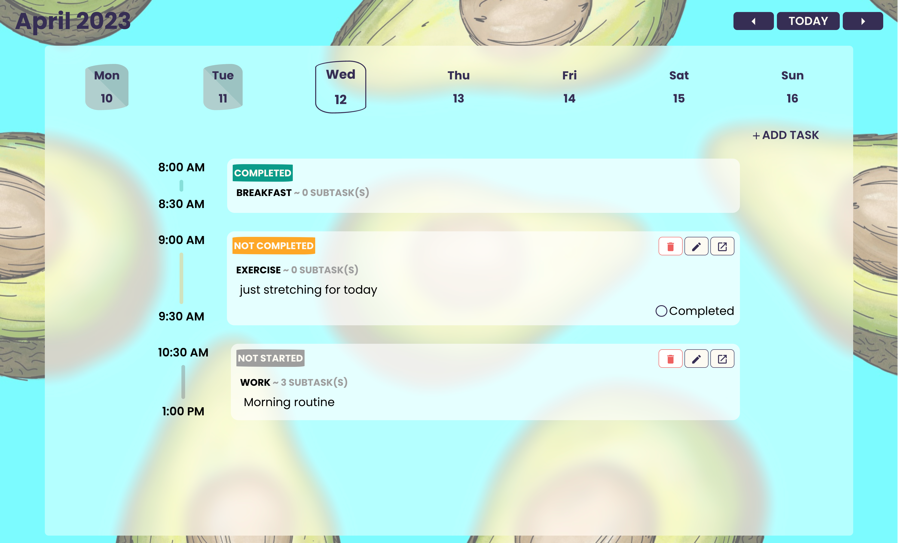
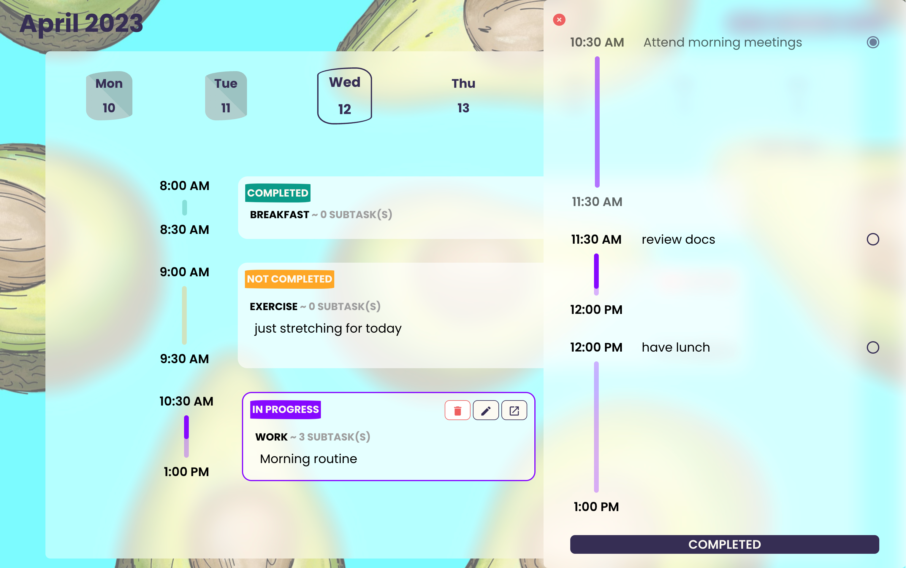
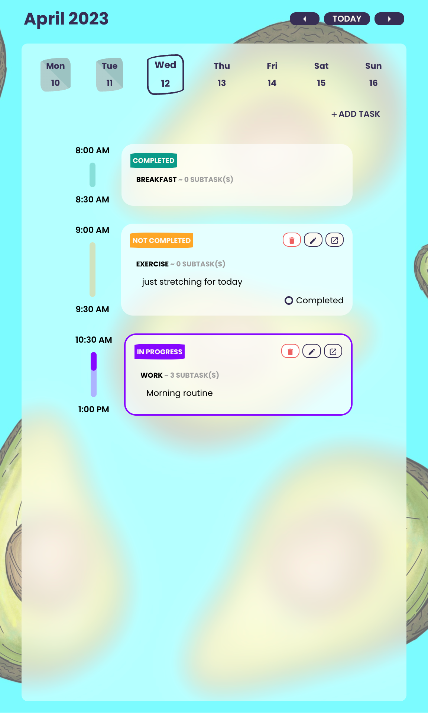
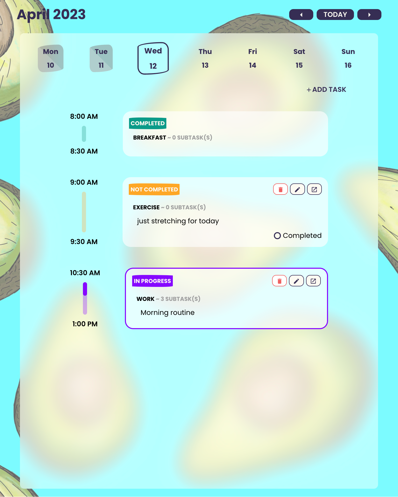
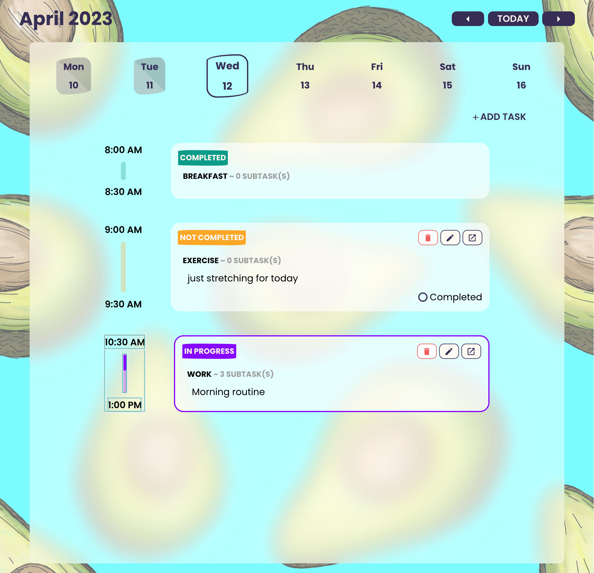
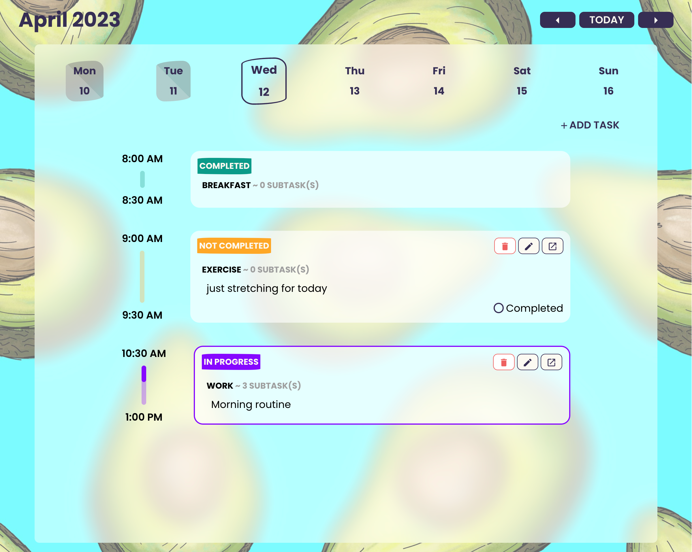

TaskerApp is a web-based application that allows users to create tasks and subtasks with specific dates and times. The application is hosted on [Render](https://render.com/) as a cloud service, making it easily accessible from anywhere with an internet connection.

## Usage

To use TaskerApp, you can visit:
[TaskerApp](https://tasker-app-6xhh.onrender.com)

Once there, you will be presented with the TaskerApp homepage. From here, you can create new tasks and subtasks, mark tasks as completed, and view the status and progress of your tasks. When the time has come your task status will change to 'In Progress' automatically.

## Features

-   Create, delete, edit tasks and subtasks, set due dates and times for tasks, mark tasks as completed
    
-   View color-coded status of tasks for previous days
    <table>
        <tr>
            <td>All tasks completed</td>
            <td>You have an uncompleted task</td>
        </tr>
        <tr>
            <td>
                
            </td>
            <td></td>
        </tr>
    </table>

-   See details about tasks, subtasks and progress bar and mark them as completed
    

-   Tasker application is a responsive app with following breakpoints:
    576px, 768px, 992px, 1200px
    <table>
        <tr>
            <td>576px <= screen-size < 768px</td>
            <td>768px <= screen-size < 992px</td>
            <td>992px <= screen-size < 1200px</td>
            <td>screen-size >= 1200px</td>
        </tr>
        <tr>
            <td>
                
            </td>
            <td>
                
            </td>
            <td>
                
            </td>
            <td>
                 
            </td>
        </tr>
    </table>

## Tech Stack

### Front End

-   React
-   TypeScript
-   Redux Toolkit
-   Styled Components

### Back End

-   TypeScript
-   Express
-   Prisma (ORM)

### Database

-   MongoDB

## License

TaskerApp is licensed under the MIT License.

### Future Plans

-   add tests to back end
-   add loading status after save/delete
-   add list option on frontend
-   display list of tasks that are completed, not completed, future plans
-   add tasks to the queue for later
-   add full calendar to the main page
-   change task title with tag it can be dropdown maybe (work, study, workout, shopping, other)
-   add wheather api and display wheather
-   set Goals and link them to tasks
